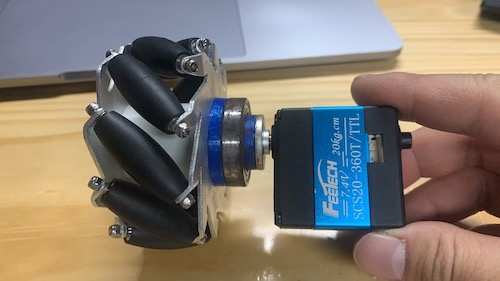
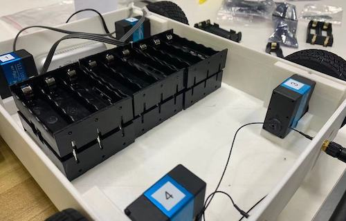

# OmniBot-4 开发日志

**Author**：Jerry Peng   &nbsp; &nbsp; &nbsp; **Date**：Nov. 9th, 2020
  
  

 ## 目标

 在之前全向轮小车的基础上，完善出一款全向轮小车产品。设计原型参考如下：

 

  
  

 ## 设计要求（外形结构）

 * 外形：长方体形状
 * 尺寸：同原型，约280x210x45mm(长x宽x高，尺寸不含轮，仅为车体)
 * 轮子：采用铝合金款式麦克纳姆轮（如下图）；
 * 电机：计划选用SCS20-360T电机（如下图）；
  
     

 * 细节：  
    1. 电机与轮子的连接方式：设计转接件，一头用长M3螺丝固定，另一头固定舵盘。固定舵盘一侧可以改用无头螺丝适当缩短该部件，`该部件后续用机加生产`。
   
        

    2. 轮子与车体固定方式：设计轴承固定件，侧面固定6804轴承。`该部件后续用机加生产，目前可以设计独立的3D打印件验证，不需要跟外壳一体`。
   
        

    3. 外壳结构：上下侧面后续用钣金生产，上下面用铜柱支持连接，当前用3D打印验证设计即可。
   
  
  

 ## 设计要求20201230（功能配置）
 
 * 视觉：使用RealSense D435i内置于车体前侧。固定孔位考虑兼容更换T265。 也可以通过支架外置在车体上方；
 * 开发板：Jetson Nano & Xavier NX，接口后侧朝外；
 * 主板：集成ESP32、电池（12V：1.直供Xavier， 2.降压到5V供Nano， 3.降压到7.5V驱动电机；）
 * 后侧板：天线、开关、充电口
 * 上盖板：摄像头增高支架（前&后固定孔位）、LiDAR固定孔位、叠加扩展层固定孔位

 ## 结构设计改动拆分 20210104
 * 车体前侧面板：开长条形视觉部分开口，固定相机部分（设计独立的3D打印件固定D435i/T265两款相机），让相机镜头平面与车体前侧面板的外侧齐平；
 * 车体后侧面板：1. 天线固定口较上一版外移，孔位中心距边缘40mm；
               2. 中部位置增加开发板连接开口（一个大开口，可以通过固定额外3D打印挡板封闭）；
               3. 左侧天线外侧开口固定充电口，右侧天线外侧开口固定开关。

 * 后侧考虑空间和外观，用12mm金属按钮开关，考虑大电流，因此电路上需要考虑加继电器

 ## 电路设计分析 202101019
 * 电源部分
    * 开关：用12mm金属按钮开关，考虑大电流，因此加场效管（IRF7811AV【161A】/ [AOD742【55A】](https://wenku.baidu.com/view/8af9746048d7c1c708a145a1.html),其它型号的TO-252封装的MOS N沟道，设计双路并联[预留一路]）；
    * 电池：使用18650 3*6（PCB底层，放不下的初步PCB可以放顶层，车体下侧开口安装），12V；

      

    * 电机：实测12V也能运动，可以使用降压电路，12V → 9V(5A)[降压模块](https://detail.tmall.com/item.htm?spm=a1z10.5-b-s.w4011-21581825912.109.403f5350evj5Rj&id=625397652185&rn=2259c623d5a88a051d8188381cb2a518&abbucket=8) 供电；
    * Nano开发板：使用降压电路，12V → 5V(5A) [降压模块](https://detail.tmall.com/item.htm?spm=a1z10.5-b-s.w4011-21581825912.109.403f5350evj5Rj&id=625397652185&rn=2259c623d5a88a051d8188381cb2a518&abbucket=8) 供电；
    * NX开发板：12V直接供电。

 * 主控部分
    * MCU：ESP32
    * 电机通信：UART转半双工电路
    * 开发板通信：UART接口
    * 电压检测
    * 蜂鸣器

## 2021-2-2 外壳设计完善要求
* 下底板增开：①主板电路固定孔位，②电池安装开孔；
* 设计电池盖板（含固定孔位）；
  

## 2021-2-7 电路板测试

1. 【问题】：接上开关（LED +极）时，在不按下LED按钮开关状态下，LED半点亮，电路中器件也出于半供电状态。 由于LED电路接入了MOS管的DG间，导致了复杂的回路；
    【方案】：开关的LED - 管脚接到P-，经测试问题得到解决；

  
2. 【不足】：充电口方向输出电压的问题。若加二极管会有压降，造成充电不足。 可以考虑加一个自恢复保险丝，为锂电池充放电模块增添双保险。

## 2021-2-24 V0.1样机

 ### 功能
 * 4轮驱动（机器人舵机）;
 * RGBD视觉（RealSense D435i);
 * SLAM(RealSense T265);
 * 最多支持插入15个18650电池（超大容量）；
 * ESP32 微控制器，内含WiFi & BT;
 * 支持NVIDIA Jetson nano & xavier NX 开发板（双天线外置）；
 * 12V，5A充电接口。

  

### 不足
* 电机转速较慢，最大行驶速度约0.25m/s (装配φ75mm车轮)

 
 

## 电机选型

### 直流减速编码电机性能
* 换用尺寸相似的直流减速编码电机（JGB37减速器，520电机，1:50减速比，12V供电），装配φ80mm轮胎测试，行驶速度约1m/s;
* 通过选配更低减速比减速器或更换较大轮胎，最高行驶速度可方便提升到2m/s左右，若需更高则需选用无刷电机。

### 下一版需升级改进
* 外观结构：
  * 设计钣金结构件（先用3D打印验证）：
    * 侧面电机固定：电机固定方向同之前3D打印测试样机，与底板间的固定孔位可开螺纹方便安装；
    * 底板：由于编码电机比舵机稍长，车体宽度应试相应增加，让Jetson Nano开发板也能刚好放下；
* 电路板：【增加】A4950直流电机驱动（后续为了方便产品维修更换，可以做成接插模块）、编码器反馈检测电路、5V5A降压换用 国产芯龙，如[XL4005/XL4501系列芯片](http://www.xlsemi.com/products.html)，【去除】机器人舵机变压、总线通信电路；
* 固件程序：【增加】直流编码电机控制算法。

## 2021-3-2 钣金打样设计要求
1. 用于固定前后侧面板的螺孔可以放在前后侧面板上，左右侧开孔从左右侧面板锁螺丝固定，这样即使要用5mm厚板材，也只需要用于前后侧面板； 
2. 上侧板固定可以通过前后侧面板上侧开螺纹固定；
3. 电路板的USB下载开口位置参考白色样机实际情况做微调，让电路板上的插口居中（之前偏低）；
4. 车身长度增加10mm（前后各5mm)，以保障前侧相机连线和后侧板卡连线的空间（注意：电机、电路板、电池盖等部分位置关系不要变化，之前车体最前侧、最后侧调整）；
5. 如下图位置，开2个M2螺丝过孔，便于后续固定封闭尾板：

## 2021-3-23 电路板测试
问题：（IO功能性问题？ 电机隔离性问题？）
* 电源接通时，有时候下不进程序；
* 4950 的VCC应该连 3V3  (其实是V_{REF}, 用来做限流的，跟控制不太有关系)；
* motor_2控制引脚 GPIO16、17 控制（经测试，sigmaDelta不支持该引脚；ledc支持）
* 外力作用或都抖动时，电路板容易偶尔闪亮，开关电路不稳定？
* 电机4反馈检测数值偏高（用C1、C2都是，测试发现一块电路板偏高一点，另一块偏高很多），经进一步测试，应该是电机个体或驱动差异性，反馈应该OK。总之，直接从空载运动时的数值看，不太稳定。
  
  

* 嘗試增加IMU

## 2021-3-30 

A4950 Datasheet学习
* 电机模式：
  * Standby（IN1 = IN2 = LOW): 待机无力状态；
  * Breaking (IN1 = IN2 = HIGH): 阻尼状态，经测试对运动状态下的刹车效果显著，停下后阻尼手感不大。

* 电机限流：$I_{TripMAX} = \frac{V_{REF}}{(10 \times Rs)}$   
  * 当 $V_{REF}=5V, I_{OUT}=2A$ 时，选用的 Rs = 0.25Ω

## 2021-5-4
[加外接天线链接](https://community.home-assistant.io/t/how-to-add-an-external-antenna-to-an-esp-board/131601/2)

## 2021-5-7

* PID控制问题：后侧两个轮子速度明显比前面两个慢很多，调试发现是后侧反馈不太稳定（波动较大）
* 解决方法：去除后侧两路反馈电路上的电阻、电容后，初步解决。
* 思考：是否全部不加电阻电容，下一块电路板上试一试。
* 右前轮反馈跟ESP32板上的LED IO重复，建议修改。

## 2021-8-3

* 做室内智能应用，编码减速电机可以用1:90减速比电机；
* TTL-UART接口测试并加上拉电阻、电容贴片位；

